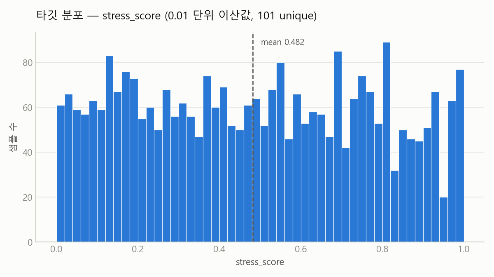
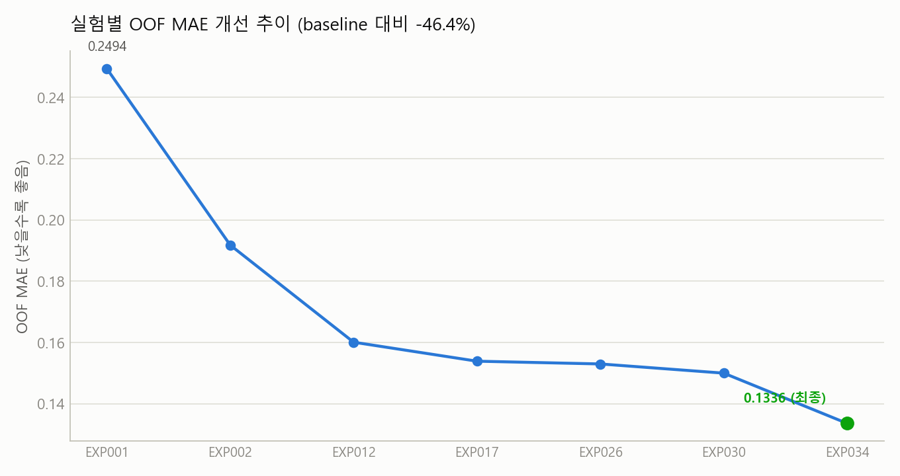
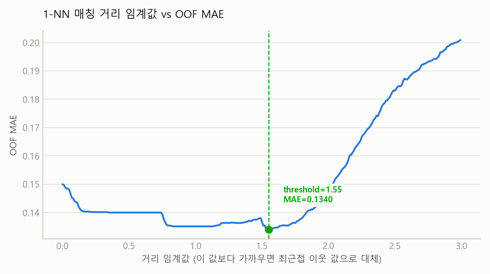

# 🩺 스트레스 지수 예측 AI 해커톤

> Baseline DummyRegressor (OOF MAE 0.2494) → **101-class 분류 재정의 + Crossfit Calibration + 1-NN Matching Hybrid**로 **OOF MAE 0.1336** 달성 (-45.9%)
>
> [DACON｜AI 헬스케어 4기 해커톤: 스트레스 지수 예측 AI 해커톤] 참가 프로젝트 (개인 참가, 2026.06.16 ~ 2026.06.18)

[](#실험-히스토리)
[](#실험-히스토리)
[](#실험-히스토리)
[](#실험-히스토리)

---

## 📌 이 저장소를 보기 전에 (코드 공개 범위 안내)

이 대회는 [DACON 참가 동의사항](https://dacon.io/competitions/official/236734/overview/agreement)에 따라 **대회 정보를 기반으로 개발한 소스/실행 코드를 공개적으로 공유할 때는 데이콘 플랫폼을 통해야 한다는 조항**이 있습니다. 코드 공개 범위가 명확해지기 전까지 **실험 코드·최종 파이프라인·제출 파일은 비공개** 처리했습니다.

즉 이 README는 "코드가 없어서 부실한 저장소"가 아니라, **의도적으로 규정을 준수한 결과물**입니다. 공개된 것은:

- 📝 1~2일차 EDA·도메인 조사 원본 기록 ([`notes/`](notes/))
- 📊 원본 데이터가 포함되지 않은 결과 시각화 3장 ([`reports/`](reports/))
- 이 README에 정리한 접근 방법 · 실험 히스토리 · 인사이트 요약

전체 코드가 필요하신 분은 문의 주시면 별도로 공유해 드립니다.

<br>

## 문제 정의

- 입력: 나이·혈압·혈당·콜레스테롤·수면패턴·근로시간 등 17개 feature (수치형 9 + 범주형 7 + ID)
- 출력: `stress_score` (0.00 ~ 1.00)
- 평가 지표: MAE (낮을수록 좋음)
- 제약: 외부 데이터 학습 금지, test 통계/분포를 전처리·인코딩·구간화에 사용 금지 (data leakage)

## 접근 방법

```
Raw Data
  → Feature Engineering (BMI, MAP, Pulse Pressure, Partial ALI — 전부 fold-내부 fit)
  → ExtraTreesClassifier (101-class, target = round(stress_score * 100))
  → Expected Value 디코딩 (Σ P(y=c) · c/100, argmax 아님)
  → Crossfit Linear Calibration (fold별 a·pred+b 탐색 → test는 median 적용)
  → 1-NN Matching Hybrid (train과 거리가 가까운 test는 최근접 이웃 값으로 대체)
  → Round to 0.01
```

**핵심 아이디어 3가지**

1. **문제 재정의**: target이 `{0.00, 0.01, …, 1.00}` 101개 값으로만 관찰됨 → 회귀 대신 분류로 풀고,
   확률 가중평균(expected value)으로 연속값을 복원. argmax보다 MAE에 안정적으로 유리했습니다.
2. **누수 없는 검증**: 모든 전처리(임퓨터·인코더·ALI 임계치·보정 계수·NN 스케일러)를 fold의
   학습 분할에서만 fit. `target_bin` 기반 StratifiedKFold로 OOF MAE 0.1336, Public MAE 0.1350
   — 격차 0.0014로 검증 전략이 실전 순위까지 그대로 이어졌습니다.
3. **후처리 하이브리드**: 예측 분포가 실제보다 좁게 나오는 수축 현상을 fold별 선형 보정으로 펴고,
   test가 train과 충분히 가까우면(거리 < 1.55) 최근접 이웃의 실제 target으로 대체.

## 실험 히스토리

| 실험 | 핵심 아이디어 | OOF MAE |
|---|---|---|
| EXP001 | DummyRegressor baseline | 0.2494 |
| EXP002 | ExtraTreesRegressor 기본 | 0.1918 |
| EXP012 | Feature Engineering + 튜닝 | 0.1601 |
| EXP017 | 101-class 분류 재정의 + Expected Value | 0.1539 |
| EXP026 | Seed7 + Expanded Tuning | 0.1530 |
| EXP030 | Crossfit Linear Calibration | 0.1500 |
| **EXP034** | **+ NN Matching Hybrid + Round(0.01) — 최종** | **0.1336** |

전체 실험 코드는 [`experiments/`](experiments/)에 번호별로 정리되어 있습니다.
실험별 진행 과정과 시행착오는 [Notion 실험 로그](https://icy-butterfly-e42.notion.site/AI-38132d2dbec580e68840c2eebcbda2ed?source=copy_link)에 시간순으로 기록되어 있습니다.

### 시도했지만 채택하지 않은 것

- 스태킹(Ridge·LGBM meta over OOFs) — 0.157대로 악화
- LGBM 101-class classifier — ExtraTrees보다 0.01 나쁨
- ET+LGBM 블렌드 — 최적 가중치가 결국 LGBM 0%로 수렴 (LGBM 기여 없음)
- Multi-seed ExtraTrees(4 seeds) — 단일 seed=7과 동일/소폭 악화
- k-NN 회귀(k=3,5,7), 3-band hybrid — k=1보다 떨어지거나 효과 없음
- Ordinal encoding for `edu_level` — 오히려 악화

복잡한 조합보다 단순한 구조(ExtraTrees + NN + 양자화)가 이 데이터에는 가장 강했습니다.

## 결과 시각화



타깃이 0.01 단위 101개 값으로 이산적으로 분포하는 것이 이번 문제를 회귀 대신
101-class 분류로 재정의하게 된 근거였습니다.



DummyRegressor 베이스라인 대비 최종 파이프라인까지 OOF MAE가 46.4% 개선됐습니다.



거리 임계값을 0~3 사이에서 탐색한 결과 1.55 부근에서 OOF MAE가 최소가 되어,
이 값을 최근접 이웃 대체 여부의 기준으로 채택했습니다.

## 배운 점 & 한계

**배운 것**
- 전처리·파생·모델 fit을 전부 fold 내부에서만 수행하면 test 누수는 물론, 검증 fold 사이의
  누수까지 구조적으로 막을 수 있다는 것을 체감했습니다.
- 타깃 구조(0.01 단위 이산값)를 관찰해 회귀를 분류로 재정의하고, argmax 대신 확률 기대값을
  쓰면 MAE라는 지표 자체에 더 맞는 예측을 만들 수 있다는 것을 배웠습니다.
- 검증 MAE와 Public MAE의 격차가 0.001 수준에 그쳐, target bin 기반 StratifiedKFold 검증이
  실전 순위까지 신뢰할 수 있다는 확신이 생겼습니다.

**한계와 다음 방향**
- test의 약 42%를 최근접 이웃 값으로 통째 대체하는 구조라, train과 분포가 조금이라도
  어긋나면 이 부분의 예측이 흔들릴 수 있는 구조적 의존이 있습니다.
- 다음엔 거리 구간별 신뢰도로 NN과 보정 예측을 연속적으로 가중하고, NN 경로의 결측 대치·
  인코딩도 트리 파이프라인처럼 fold 내부 fit으로 통일하고, 선형 보정을 isotonic 등 단조
  보정으로, 분류기·fold 시드를 다변화하는 방향으로 보완할 계획입니다.

## 저장소 구조

```
.
├── README.md
├── data/
│   └── README.md                  # 데이터 다운로드 안내 + 컬럼 설명
├── reports/                       # 결과 시각화 산출물(png 3장) — 생성 코드는 비공개
└── notes/                         # 1~2일차 EDA·도메인 조사 원본 기록
```

`experiments/`(EXP001~034 실험 코드), `legacy/`, `final_submission.ipynb`, `submissions/`,
`reports/`의 차트 생성 코드는 [코드 공개 범위 안내](#-이-저장소를-보기-전에-코드-공개-범위-안내)에 따라
비공개(`.gitignore`) 처리했습니다.

## Stack

`Python` · `pandas` · `scikit-learn` (`ExtraTreesClassifier`, `NearestNeighbors`, `StratifiedKFold`)
